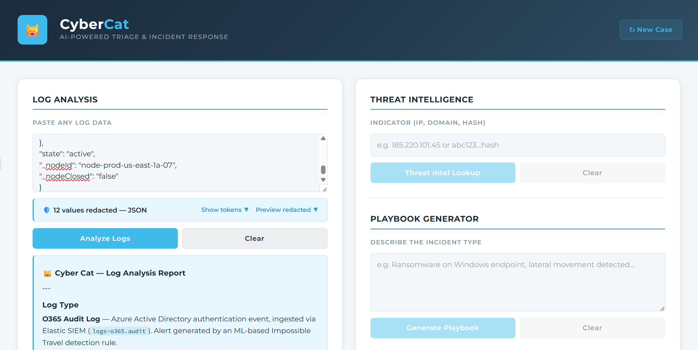

<div align="center">

```
 ██████╗██╗   ██╗██████╗ ███████╗██████╗  ██████╗ █████╗ ████████╗
██╔════╝╚██╗ ██╔╝██╔══██╗██╔════╝██╔══██╗██╔════╝██╔══██╗╚══██╔══╝
██║      ╚████╔╝ ██████╔╝█████╗  ██████╔╝██║     ███████║   ██║   
██║       ╚██╔╝  ██╔══██╗██╔══╝  ██╔══██╗██║     ██╔══██║   ██║   
╚██████╗   ██║   ██████╔╝███████╗██║  ██║╚██████╗██║  ██║   ██║   
 ╚═════╝   ╚═╝   ╚═════╝ ╚══════╝╚═╝  ╚═╝ ╚═════╝╚═╝  ╚═╝   ╚═╝  
```

### 🐱 AI-Powered SOC Triage & Incident Response

*Smarter triage. Faster response. Privacy by design.*

[](https://opensource.org/licenses/MIT)
[](https://anthropic.com)
[](https://react.dev)
[](CONTRIBUTING.md)

</div>

---

## What is CyberCat?

CyberCat is an AI-powered security analyst assistant built for SOC teams and security engineers. It combines the reasoning capabilities of Claude (Anthropic's AI) with security-specific tooling to help analysts triage alerts, analyze logs, generate incident documentation, look up threat intelligence, and hunt for threats — all in a single, privacy-safe browser interface.

**No backend required for Phase 1.** CyberCat runs entirely in the browser as a single React component.

> ⚠️ **Privacy first:** Sensitive customer data is automatically redacted before it reaches the AI. The built-in PII redaction engine scrubs usernames, hostnames, IP addresses, session IDs, SIDs, email addresses, and more across 8+ log schemas — before any log is submitted to Claude.

---

## Screenshot

> 📸 
> 
> Recommended: a side-by-side showing a raw log input and the AI triage output.  
> Tool: [CleanShot X](https://cleanshot.com) (Mac) or [ShareX](https://getsharex.com) (Windows)

---

## Features

### 🔍 Log Analysis
Paste any log format — Windows Event Logs, Syslog, O365, firewall, EDR, SIEM — and receive a structured AI triage. Every finding is classified as:
- ✅ **Benign** — expected activity
- ⚠️ **Suspicious** — warrants investigation
- 🚨 **Malicious** — confirmed threat with recommended containment steps

### 📊 CSV Analysis
Upload CSV exports from your SIEM or EDR. Claude scans for anomalies, behavioral patterns, and security-relevant indicators across the dataset.

### 🔎 IOC Extractor
Paste any log or analyst output to automatically extract and categorize indicators of compromise: external IPs, internal IPs, SHA256/MD5/SHA1 hashes, domains, URLs, email addresses, registry keys, file paths, and CVEs. Supports one-click copy and CSV export.

### 🌐 Threat Intelligence Lookup
Submit any indicator — IP address, domain, or file hash — and receive an AI-generated threat assessment covering known associations, threat actor attribution, reputation, and recommended actions.

### 📘 Playbook Generator
Describe an incident type in plain language and generate a structured IR playbook covering all five response phases:
`Identification → Containment → Eradication → Recovery → Lessons Learned`

### 🎯 Threat Hunt Query Generator
Generate ready-to-paste threat hunting queries in your SIEM language of choice:
- **KQL** — Elastic SIEM / Microsoft Sentinel
- **SPL** — Splunk
- **Sigma** — Compiled to any target

Includes expected false positives and recommended pivot queries. Logs are sanitized before submission — field structure is preserved, sensitive values are stripped.

### 📧 Smart Email Engine
Paste a raw log and CyberCat auto-detects the log type, extracts relevant fields, and pre-populates a professional security alert email — timestamp, source IP, affected user, hostname, and more — ready to send.

### 💬 Communications Generator
Generate structured SOC communications from incident context:
- **Alert emails** — Standard informational, EDR detections, PUP removals
- **Incident summaries** — Structured narrative for ticket documentation
- **Escalation reports** — Formatted for management or Tier 2 escalation
- **Close-out notes** — End-of-incident documentation

### 💬 Analyst Chat
Freeform chat with the Cyber Cat persona — a senior SOC analyst — for ad hoc queries, log interpretation, and threat hunting guidance.

---

## Privacy Architecture

CyberCat includes a client-side PII redaction engine that runs **before** any data is submitted to the Claude API.

**How it works:**
1. You paste a log into any CyberCat tool
2. The redaction engine scans the log for sensitive fields using a schema-aware field map
3. Sensitive values are replaced with consistent numbered tokens: `[USER_001]`, `[HOST_001]`, `[IP_001]`, etc.
4. Only the tokenized log is sent to Claude
5. You can inspect the full token map to see exactly what was redacted

**Supported schemas:**
| Schema | Coverage |
|--------|----------|
| Windows Event Logs | Users, hosts, SIDs, logon IDs, process IDs |
| O365 / Exchange | Email addresses, user keys, session IDs, tenant IDs |
| Microsoft Defender / M365 | Alert IDs, incident names, device IDs |
| Okta | Actor IDs, target IDs, session IDs |
| Cisco Duo | User IDs, device IDs, auth session data |
| Fortigate Firewall | VDOMs, policy IDs, serial numbers, observer IPs |
| Darktrace | Breach IDs, device scores |
| Proofpoint TAP | Message GUIDs, queue IDs, mailbox IDs |
| Cybereason EDR | Agent IDs, profile IDs, cluster IDs |

Internal RFC 1918 IP addresses are redacted. External IPs are preserved for threat intelligence analysis.

---

## Getting Started

### Prerequisites

- A modern browser (Chrome, Firefox, Edge, Safari)
- An [Anthropic API key](https://console.anthropic.com)
- A way to serve a React component — see options below

### Option A — Claude.ai Artifacts (Easiest)

1. Go to [claude.ai](https://claude.ai)
2. Start a new conversation
3. Paste the entire contents of `cybercat.jsx` into the message
4. Ask Claude to render it as an artifact

No setup required. Best for trying it out.

### Option B — Local Development

```bash
# 1. Clone the repo
git clone https://github.com/YOUR_USERNAME/cybercat.git
cd cybercat

# 2. Create a new React project (if you don't have one)
npx create-react-app cybercat-app
cd cybercat-app

# 3. Replace src/App.jsx with cybercat.jsx
cp ../cybercat.jsx src/App.jsx

# 4. Set your API key
# Create a .env file in the project root:
echo "REACT_APP_ANTHROPIC_API_KEY=your_key_here" > .env

# 5. Start the dev server
npm start
```

> **Note:** For local development you will need a proxy or backend to handle the Anthropic API call securely. See [Phase 2 Architecture](#roadmap) for details.

### Configuration

Open `cybercat.jsx` and find the `CONFIG` block near the top of the file:

```javascript
const CONFIG = {
  // Your full name — appears in email signatures
  analystName: "Your Name",

  // Your organization or MSP name — appears in email template bodies
  orgName: "Your Organization",

  // Your title — appears alongside your name in signatures
  analystTitle: "Security Analyst",
};
```

Replace the three placeholder values with your own details. That's it.

### Color Scheme

CyberCat ships with a **Deep Purple** theme by default, but the entire color scheme is controlled by a single CSS variable block near the bottom of `cybercat.jsx`. Four pre-designed schemes are available — swap the block to match your preference or your organization's branding.

| Scheme | Base | Accent | Vibe |
|--------|------|--------|------|
| **Deep Purple** *(default)* | `#12102A` | `#7C6FE8` | Distinctive, polished |
| **Midnight Teal** | `#0A1628` | `#2BBFCC` | Clean, professional |
| **Graphite & Amber** | `#1A1A1A` | `#E8A020` | High-contrast, industrial |
| **Forest Green** | `#0B1A10` | `#3DD68C` | Terminal aesthetic |

Full variable values for each scheme are in the [Color Schemes](#color-schemes) section below.

---

## Roadmap

### ✅ Phase 1 — Complete
- [x] Log analysis with AI triage (✅ / ⚠️ / 🚨 classification)
- [x] CSV analysis
- [x] IOC extraction with CSV export
- [x] Threat intelligence lookup
- [x] Playbook generator
- [x] Threat hunt query generator (KQL, SPL, Sigma)
- [x] Smart email engine with log-type auto-detection
- [x] SOC communications generator (summaries, escalations, close-outs)
- [x] Analyst chat
- [x] PII redaction engine (9 schemas)
- [x] Streaming Claude API responses

### 🔷 Phase 2 — Planned
- [ ] VirusTotal API integration
- [ ] Secure backend server (Node.js / Python)
- [ ] Claude Tool Use — autonomous mid-analysis enrichment
- [ ] Full agentic investigation loop (detect → enrich → report)
- [ ] Expanded threat intel connectors (AbuseIPDB, Shodan, GreyNoise)
- [ ] SIEM connector for live log pulling

> Phase 2 evolves CyberCat from agentic AI into a true AI agent. See [Architecture Notes](#architecture-notes) for the distinction.

---

## Architecture Notes

**Current (Phase 1):** CyberCat is *agentic AI*. Claude provides sophisticated, multi-step reasoning and analysis, but a human initiates every action. The AI reasons — the human drives.

**Planned (Phase 2):** CyberCat will be a *true AI agent*. Claude will autonomously call external tools (VirusTotal, SIEM APIs) mid-analysis based on its own reasoning — without waiting for human input. The loop: analyze → detect indicator → call tool → incorporate result → deliver enriched report.

The distinction matters architecturally: Phase 2 requires a backend server to securely store API keys and act as the execution layer for Claude's tool calls.

---

## Color Schemes

To switch color schemes, find the CSS variable block in `cybercat.jsx` (search for `--ap-navy`) and replace it with one of the sets below. Also do a find-and-replace for the rgba values noted under each scheme.

---

### 🟣 Deep Purple *(default)*

```css
--ap-navy: #12102A;
--ap-navy-mid: #1C1840;
--ap-navy-light: #2D2660;
--ap-blue: #7C6FE8;
--ap-blue-dark: #5A4FBF;
--ap-blue-pale: #EEEDFE;
--ap-white: #ffffff;
--ap-offwhite: #F7F6FF;
--ap-border: #CECBF6;
--ap-text: #12102A;
--ap-text-mid: #4A4580;
--ap-text-light: #7B75B8;
--ap-success: #27ae60;
--ap-warn: #e67e22;
--ap-danger: #e74c3c;
```

Also replace: `rgba(124,111,232,` · `rgba(18,16,42,0.08)` · `rgba(18,16,42,0.06)` · `rgba(18,16,42,0.07)` · `rgba(18,16,42,0.2)`

---

### 🔵 Midnight Teal

```css
--ap-navy: #0A1628;
--ap-navy-mid: #112240;
--ap-navy-light: #1D3A52;
--ap-blue: #2BBFCC;
--ap-blue-dark: #1D9E72;
--ap-blue-pale: #E8F8FA;
--ap-white: #ffffff;
--ap-offwhite: #F5FAFB;
--ap-border: #B2E4EA;
--ap-text: #0A1628;
--ap-text-mid: #2E6070;
--ap-text-light: #5A8FA0;
--ap-success: #27ae60;
--ap-warn: #e67e22;
--ap-danger: #e74c3c;
```

Also replace: `rgba(43,191,204,` · `rgba(10,22,40,0.08)` · `rgba(10,22,40,0.06)` · `rgba(10,22,40,0.07)` · `rgba(10,22,40,0.2)`

---

### 🟡 Graphite & Amber

```css
--ap-navy: #1A1A1A;
--ap-navy-mid: #242424;
--ap-navy-light: #2E2E2E;
--ap-blue: #E8A020;
--ap-blue-dark: #BA7517;
--ap-blue-pale: #FFF3D6;
--ap-white: #ffffff;
--ap-offwhite: #F8F8F6;
--ap-border: #F0D090;
--ap-text: #1A1A1A;
--ap-text-mid: #5A4A20;
--ap-text-light: #8A7040;
--ap-success: #27ae60;
--ap-warn: #e67e22;
--ap-danger: #e74c3c;
```

Also replace: `rgba(232,160,32,` · `rgba(26,26,26,0.08)` · `rgba(26,26,26,0.06)` · `rgba(26,26,26,0.07)` · `rgba(26,26,26,0.2)`

---

### 🟢 Forest Green

```css
--ap-navy: #0B1A10;
--ap-navy-mid: #122518;
--ap-navy-light: #1A3322;
--ap-blue: #3DD68C;
--ap-blue-dark: #0F6E56;
--ap-blue-pale: #E4F7EE;
--ap-white: #ffffff;
--ap-offwhite: #F4FBF7;
--ap-border: #A8E8C8;
--ap-text: #0B1A10;
--ap-text-mid: #1A5A38;
--ap-text-light: #4A8A60;
--ap-success: #27ae60;
--ap-warn: #e67e22;
--ap-danger: #e74c3c;
```

Also replace: `rgba(61,214,140,` · `rgba(11,26,16,0.08)` · `rgba(11,26,16,0.06)` · `rgba(11,26,16,0.07)` · `rgba(11,26,16,0.2)`

---

## Tech Stack

| Layer | Technology |
|-------|------------|
| UI Framework | React 18 |
| AI Engine | Anthropic Claude API (`claude-sonnet-4-20250514`) |
| Streaming | Server-Sent Events via Fetch API |
| Styling | Inline CSS-in-JS with CSS custom properties |
| PII Redaction | Custom client-side engine (no external dependencies) |
| Fonts | Montserrat, Source Code Pro (Google Fonts) |

---

## Contributing

Contributions are welcome! Please read [CONTRIBUTING.md](CONTRIBUTING.md) before submitting a pull request.

Areas where help is especially appreciated:
- Additional log schema support for the PII redaction engine
- New email template types
- Threat hunt query templates for common attack patterns
- UI/UX improvements
- Documentation and examples

---

## Security

CyberCat is a security tool — please handle it responsibly.

If you discover a vulnerability in CyberCat itself, please read [SECURITY.md](SECURITY.md) for responsible disclosure guidelines.

**Important:** CyberCat sends log data to the Anthropic API. Although the PII redaction engine removes sensitive identifiers before submission, you are responsible for ensuring compliance with your organization's data handling policies before using this tool with real customer or production data.

---

## License

This project is licensed under the MIT License — see [LICENSE](LICENSE) for details.

---

## Acknowledgments

- Built on [Claude](https://anthropic.com/claude) by Anthropic
- Inspired by the daily grind of SOC analysts everywhere
- PII redaction patterns informed by real-world SIEM log schemas

---

<div align="center">

*Built by a security analyst, for security analysts.*

⭐ If CyberCat is useful to you, consider starring the repo — it helps others find it.

</div>
