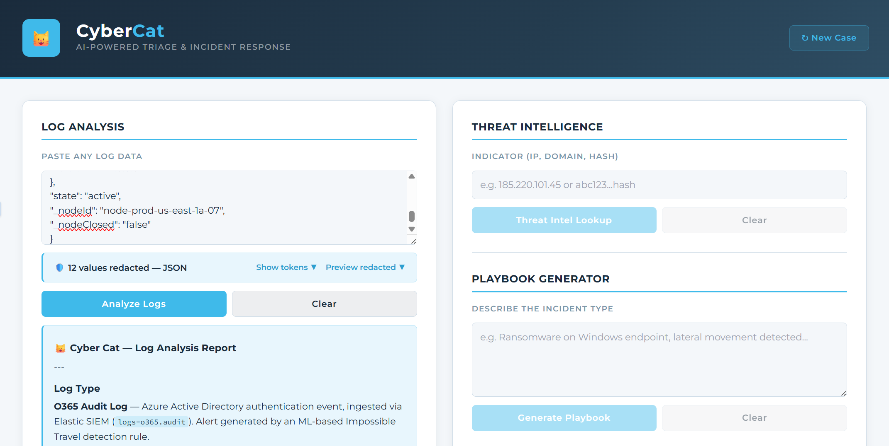

<div align="center">

```
 ██████╗██╗   ██╗██████╗ ███████╗██████╗  ██████╗ █████╗ ████████╗
██╔════╝╚██╗ ██╔╝██╔══██╗██╔════╝██╔══██╗██╔════╝██╔══██╗╚══██╔══╝
██║      ╚████╔╝ ██████╔╝█████╗  ██████╔╝██║     ███████║   ██║   
██║       ╚██╔╝  ██╔══██╗██╔══╝  ██╔══██╗██║     ██╔══██║   ██║   
╚██████╗   ██║   ██████╔╝███████╗██║  ██║╚██████╗██║  ██║   ██║   
 ╚═════╝   ╚═╝   ╚═════╝ ╚══════╝╚═╝  ╚═╝ ╚═════╝╚═╝  ╚═╝   ╚═╝  
```

### 🐱 AI-Powered SOC Triage & Incident Response

*Smarter triage. Faster response. Privacy by design.*

[](https://opensource.org/licenses/MIT)
[](https://anthropic.com)
[](https://react.dev)
[](https://github.com/YOUR_USERNAME/cybercat/releases)
[](CONTRIBUTING.md)

</div>

---

## What is CyberCat?

CyberCat is an AI-powered security analyst assistant built for SOC teams and security engineers. It combines the reasoning capabilities of Claude (Anthropic's AI) with live threat intelligence APIs and security-specific tooling to help analysts triage alerts, analyze logs, generate incident documentation, hunt for threats, and enrich indicators — all in a single, privacy-safe browser interface.

**No backend required for Claude.ai artifact deployment.** For local development with live threat intel (VirusTotal, AbuseIPDB), a lightweight proxy server is required to protect API keys. CyberCat auto-detects its environment and routes calls accordingly.

> ⚠️ **Privacy first:** Sensitive customer data is automatically redacted before it reaches the AI. The built-in PII redaction engine scrubs usernames, hostnames, IP addresses, session IDs, SIDs, email addresses, tenant IDs, and more across 19+ log schemas — before any log is submitted to Claude.

---


> 
>
>

---

## What's New in v1.2

- **⚙️ Settings System** — Persistent in-app settings modal. Configure your name, title, and organization through the UI — no code editing required. Settings are saved to localStorage and used across all templates and communications.
- **🔍 Live Threat Intelligence** — VirusTotal and AbuseIPDB integrations now active in both the IOC Extractor (per-indicator lookup buttons) and the Threat Intel module (full multi-source enrichment pipeline). Requires local backend for API key security.
- **🏠 Two-Column Layout** — Redesigned app layout with left panel (Log Analysis, CSV, IOC Extractor, Threat Hunt, Chat) and right panel (Threat Intel, Playbook, Smart Email, Communications) for a cleaner workflow.
- **📤 Send to Playbook** — Log analysis findings can now be pushed directly to the Playbook Generator with one click, streamlining the triage-to-response workflow.
- **🔄 New Case** — Header-level reset button clears all state across every module simultaneously.
- **🛡️ Expanded Redaction Engine** — Three new schemas added: AWS Security Hub / GuardDuty, SentinelOne OCSF, and Azure AD Sign-in Logs (Event Hub). Token type library expanded to 60+ labeled categories.
- **🤖 Model Updated** — Now running on `claude-sonnet-4-6`.
- **🔀 Smart API Routing** — Auto-detects localhost vs. artifact deployment and routes Claude API calls through the appropriate endpoint.

---

## Features

### 🔍 Log Analysis
Paste any log format — Windows Event Logs, Syslog, O365, firewall, EDR, SIEM — and receive a structured AI triage. Every finding is classified as:
- ✅ **Benign** — expected activity
- ⚠️ **Suspicious** — warrants investigation
- 🚨 **Malicious** — confirmed threat with recommended containment steps

Findings can be sent directly to the Playbook Generator with one click.

### 📊 CSV Analysis
Upload CSV exports from your SIEM or EDR. Claude scans for anomalies, behavioral patterns, and security-relevant indicators across the dataset.

### 🔎 IOC Extractor
Paste any log or analyst output to automatically extract and categorize indicators of compromise:
- External IPs, Internal IPs, SHA256 / MD5 / SHA1 hashes
- Domains, URLs, Email addresses
- Registry keys, File paths, CVEs

Each indicator includes one-click copy and, in local dev mode, a **Lookup** button that queries VirusTotal (hashes, domains, URLs) or AbuseIPDB (IPs) in real time. Supports Copy All and CSV export.

### 🌐 Threat Intelligence
Submit any indicator — IP address, domain, file hash, or URL — and receive a multi-source enrichment report:
1. **VirusTotal** — detection ratio, reputation score, AS owner, country *(local dev)*
2. **AbuseIPDB** — abuse confidence score, ISP, usage type *(local dev, IPs only)*
3. **Claude analysis** — AI-generated threat assessment incorporating live API data, known associations, threat actor attribution, and recommended actions

### 📘 Playbook Generator
Describe an incident type in plain language and generate a structured IR playbook covering all five response phases:
`Identification → Containment → Eradication → Recovery → Lessons Learned`

Accepts direct input from Log Analysis findings via the **Send to Playbook** button.

### 🎯 Threat Hunt Query Generator
Generate ready-to-paste threat hunting queries in your SIEM language of choice:
- **KQL** — Elastic SIEM / Microsoft Sentinel
- **SPL** — Splunk
- **Sigma** — Compiled to any target

Includes expected false positives and recommended pivot queries. Logs are sanitized before submission — field structure is preserved, sensitive values are stripped using an allowlist of 100+ safe behavioral fields.

### 📧 Smart Email Engine
Paste a raw log and CyberCat auto-detects the log type, extracts relevant fields, and pre-populates a professional security alert email — timestamp, source IP, affected user, hostname, and more — ready to send.

### 💬 Communications Generator
Generate structured SOC communications from incident context:
- **Alert emails** — Standard informational, EDR detections, PUP removals
- **Incident summaries** — Structured narrative for ticket documentation
- **Escalation reports** — Formatted for management or Tier 2 escalation
- **Close-out notes** — End-of-incident documentation

### 💬 Analyst Chat
Freeform chat with the Cyber Cat persona — a senior SOC analyst — for ad hoc queries, log interpretation, and threat hunting guidance.

---

## Privacy Architecture

CyberCat includes a client-side PII redaction engine that runs **before** any data is submitted to the Claude API.

**How it works:**
1. You paste a log into any CyberCat tool
2. The redaction engine scans the log using a schema-aware field map (19+ schemas)
3. Sensitive values are replaced with consistent numbered tokens: `[USER_001]`, `[HOST_001]`, `[IP_001]`, etc.
4. A secondary pattern sweep catches inline PII — internal IPs, email addresses, Windows SIDs, UNC paths, SAM account names — regardless of schema
5. Only the tokenized log is sent to Claude
6. You can inspect the full token map to see exactly what was redacted

**Supported schemas:**
| Schema | Coverage |
|--------|----------|
| Windows Event Logs | Users, hosts, SIDs, logon IDs, process IDs |
| Windows User Activity | Delegation targets, caller hostnames |
| Windows PowerShell | Session IDs, pipeline IDs, runspace IDs |
| O365 / Exchange | Email addresses, user keys, session IDs, tenant IDs |
| O365 Unusual Login (_source variant) | Wrapped field paths, agent IDs |
| Microsoft Defender / M365 | Alert IDs, incident names, device IDs, tenant IDs |
| Microsoft Defender Identity | User evidence, device evidence |
| Microsoft Defender Alerts | Alert metadata, provider IDs |
| Okta Authentication | Actor IDs, target IDs, session IDs, device fingerprints |
| Cisco Duo MFA | User IDs, device IDs, auth session data |
| Fortigate Firewall | VDOMs, policy IDs, serial numbers, observer IPs |
| Darktrace Model Breach | Breach IDs, device scores, model editor |
| Proofpoint TAP | Message GUIDs, queue IDs, recipient addresses |
| Cybereason / ArmorXDR EDR | Agent IDs, profile IDs, cluster IDs |
| AWS Security Hub / GuardDuty | Account IDs, resource IDs, IAM principals, finding IDs |
| SentinelOne OCSF | Device UIDs, account IDs, site/group IDs, certificate data |
| Azure AD Sign-in Logs | Tenant IDs, service principal IDs, correlation IDs, session IDs |
| O365 Exchange Mailbox Audit | Mailbox IDs, actor/target context IDs |

Internal RFC 1918 IP addresses are always redacted. External IPs are preserved for threat intelligence analysis.

---

## Getting Started

### Prerequisites

- A modern browser (Chrome, Firefox, Edge, Safari)
- An [Anthropic API key](https://console.anthropic.com) *(for local dev)*
- **For live threat intel:** VirusTotal API key and/or AbuseIPDB API key

### Option A — Claude.ai Artifacts (Easiest)

1. Go to [claude.ai](https://claude.ai)
2. Start a new conversation
3. Paste the entire contents of `cybercat.jsx` into the message
4. Ask Claude to render it as an artifact

No setup required. Claude API calls are handled by the platform. Live threat intel lookups are not available in this mode — the app auto-detects this and hides the lookup buttons.

### Option B — Local Development (Full Features)

```bash
# 1. Clone the repo
git clone https://github.com/YOUR_USERNAME/cybercat.git
cd cybercat

# 2. Set up a Node.js proxy server
# Create server.js in the project root (see Proxy Server Setup below)

# 3. Create your .env file
cp .env.example .env
# Edit .env and add your API keys

# 4. Start the proxy server
node server.js

# 5. Serve cybercat.jsx
# Option: use a simple static server or integrate into a React project
npx serve .
```

### Proxy Server Setup

CyberCat expects a local Node.js server at `http://localhost:3001` with the following endpoints:

| Endpoint | Purpose |
|----------|---------|
| `POST /api/claude` | Proxies requests to the Anthropic API |
| `GET /api/virustotal?type=&value=` | VirusTotal lookup (hash, ip, domain, url) |
| `GET /api/abuseipdb?ip=` | AbuseIPDB lookup (IPs only) |

A minimal Express proxy implementation is available in the repository. See `server.js`.

### Environment Variables

```env
ANTHROPIC_API_KEY=your_anthropic_key_here
VIRUSTOTAL_API_KEY=your_virustotal_key_here   # optional
ABUSEIPDB_API_KEY=your_abuseipdb_key_here     # optional
PORT=3001
```

### Configuration

In local dev mode, open the app and click the **⚙️ Settings** button in the header to configure:
- **Full Name** — used in email signatures
- **Title** — displayed alongside your name
- **Organization** — used in email template bodies

Settings are saved to localStorage and persist across sessions.

---

## Color Schemes

CyberCat ships with a **Deep Purple** theme by default, but the entire color scheme is controlled by a single CSS variable block near the bottom of `cybercat.jsx`. Four pre-designed schemes are available.

| Scheme | Base | Accent | Vibe |
|--------|------|--------|------|
| **Deep Purple** *(default)* | `#12102A` | `#7C6FE8` | Distinctive, polished |
| **Midnight Teal** | `#0A1628` | `#2BBFCC` | Clean, professional |
| **Graphite & Amber** | `#1A1A1A` | `#E8A020` | High-contrast, industrial |
| **Forest Green** | `#0B1A10` | `#3DD68C` | Terminal aesthetic |

Full variable values for each scheme are in the [Color Schemes](#color-schemes-1) section below.

---

## Roadmap

### ✅ Phase 1 — Complete
- [x] Log analysis with AI triage (✅ / ⚠️ / 🚨 classification)
- [x] CSV analysis
- [x] IOC extraction with per-indicator copy and CSV export
- [x] Threat intelligence lookup
- [x] Playbook generator with direct push from log analysis
- [x] Threat hunt query generator (KQL, SPL, Sigma)
- [x] Smart email engine with log-type auto-detection
- [x] SOC communications generator (summaries, escalations, close-outs)
- [x] Analyst chat
- [x] PII redaction engine (19 schemas, 60+ token types)
- [x] Streaming Claude API responses
- [x] In-app settings with localStorage persistence
- [x] VirusTotal & AbuseIPDB integration (local dev)
- [x] Auto-detecting proxy routing (artifact vs. local)
- [x] New Case reset and two-column layout

### 🔷 Phase 2 — Planned
- [ ] Full backend deployment guide (production-ready Node.js server)
- [ ] Claude Tool Use — autonomous mid-analysis enrichment
- [ ] Full agentic investigation loop (detect → enrich → report)
- [ ] Expanded threat intel connectors (Shodan, GreyNoise, AlienVault OTX)
- [ ] SIEM connector for live log pulling
- [ ] Case management — save and revisit past investigations

> Phase 2 evolves CyberCat from agentic AI into a true AI agent. See [Architecture Notes](#architecture-notes) for the distinction.

---

## Architecture Notes

**Current (Phase 1):** CyberCat is *agentic AI*. Claude provides sophisticated, multi-step reasoning and analysis. In local dev mode, VirusTotal and AbuseIPDB are queried before Claude runs, and their results are passed as context — but the analyst still initiates every action.

**Planned (Phase 2):** CyberCat will be a *true AI agent*. Claude will autonomously call external tools mid-analysis based on its own reasoning — without waiting for human input. The loop: analyze → detect indicator → call tool → incorporate result → deliver enriched report.

The distinction matters architecturally: Phase 2 requires Claude Tool Use (function calling) where Claude itself decides when to invoke enrichment APIs, rather than the application pre-fetching data and injecting it into the prompt.

---

## Color Schemes

To switch color schemes, find the CSS variable block in `cybercat.jsx` (search for `--ap-navy`) and replace it with one of the sets below.

### 🟣 Deep Purple *(default)*
```css
--ap-navy: #12102A;       --ap-navy-mid: #1C1840;    --ap-navy-light: #2D2660;
--ap-blue: #7C6FE8;       --ap-blue-dark: #5A4FBF;   --ap-blue-pale: #EEEDFE;
--ap-white: #ffffff;       --ap-offwhite: #F7F6FF;    --ap-border: #CECBF6;
--ap-text: #12102A;        --ap-text-mid: #4A4580;    --ap-text-light: #7B75B8;
--ap-success: #27ae60;     --ap-warn: #e67e22;        --ap-danger: #e74c3c;
```

### 🔵 Midnight Teal
```css
--ap-navy: #0A1628;       --ap-navy-mid: #112240;    --ap-navy-light: #1D3A52;
--ap-blue: #2BBFCC;       --ap-blue-dark: #1D9E72;   --ap-blue-pale: #E8F8FA;
--ap-white: #ffffff;       --ap-offwhite: #F5FAFB;    --ap-border: #B2E4EA;
--ap-text: #0A1628;        --ap-text-mid: #2E6070;    --ap-text-light: #5A8FA0;
--ap-success: #27ae60;     --ap-warn: #e67e22;        --ap-danger: #e74c3c;
```

### 🟡 Graphite & Amber
```css
--ap-navy: #1A1A1A;       --ap-navy-mid: #242424;    --ap-navy-light: #2E2E2E;
--ap-blue: #E8A020;       --ap-blue-dark: #BA7517;   --ap-blue-pale: #FFF3D6;
--ap-white: #ffffff;       --ap-offwhite: #F8F8F6;    --ap-border: #F0D090;
--ap-text: #1A1A1A;        --ap-text-mid: #5A4A20;    --ap-text-light: #8A7040;
--ap-success: #27ae60;     --ap-warn: #e67e22;        --ap-danger: #e74c3c;
```

### 🟢 Forest Green
```css
--ap-navy: #0B1A10;       --ap-navy-mid: #122518;    --ap-navy-light: #1A3322;
--ap-blue: #3DD68C;       --ap-blue-dark: #0F6E56;   --ap-blue-pale: #E4F7EE;
--ap-white: #ffffff;       --ap-offwhite: #F4FBF7;    --ap-border: #A8E8C8;
--ap-text: #0B1A10;        --ap-text-mid: #1A5A38;    --ap-text-light: #4A8A60;
--ap-success: #27ae60;     --ap-warn: #e67e22;        --ap-danger: #e74c3c;
```

---

## Tech Stack

| Layer | Technology |
|-------|------------|
| UI Framework | React 18 |
| AI Engine | Anthropic Claude API (`claude-sonnet-4-6`) |
| Streaming | Server-Sent Events via Fetch API |
| Threat Intel | VirusTotal API, AbuseIPDB API |
| Proxy Layer | Node.js / Express *(local dev)* |
| Styling | Inline CSS-in-JS with CSS custom properties |
| PII Redaction | Custom client-side engine (no external dependencies) |
| Settings Persistence | localStorage |
| Fonts | Montserrat, Source Code Pro (Google Fonts) |

---

## Contributing

Contributions are welcome! Please read [CONTRIBUTING.md](CONTRIBUTING.md) before submitting a pull request.

Areas where help is especially appreciated:
- Additional log schema support for the PII redaction engine
- New email template types
- Threat hunt query templates for common attack patterns
- Additional threat intel API integrations (Shodan, GreyNoise, AlienVault OTX)
- UI/UX improvements
- Documentation and examples

---

## Security

CyberCat is a security tool — please handle it responsibly.

If you discover a vulnerability in CyberCat itself, please read [SECURITY.md](SECURITY.md) for responsible disclosure guidelines.

**Important:** CyberCat sends log data to the Anthropic Claude API and, in local dev mode, sends indicator data to VirusTotal and AbuseIPDB. Although the PII redaction engine removes sensitive identifiers before submission, you are responsible for ensuring compliance with your organization's data handling policies before using this tool with real customer or production data.

**API Key Security:** Never commit `.env` files or API keys to version control. The `.gitignore` in this repo excludes `.env` files by default.

---

## License

This project is licensed under the MIT License — see [LICENSE](LICENSE) for details.

---

## Acknowledgments

- Built on [Claude](https://anthropic.com/claude) by Anthropic
- Threat intelligence powered by [VirusTotal](https://virustotal.com) and [AbuseIPDB](https://abuseipdb.com)
- Inspired by the daily grind of SOC analysts everywhere
- PII redaction patterns informed by real-world SIEM log schemas

---

<div align="center">

*Built by a security analyst, for security analysts.*

⭐ If CyberCat is useful to you, consider starring the repo — it helps others find it.

</div>
